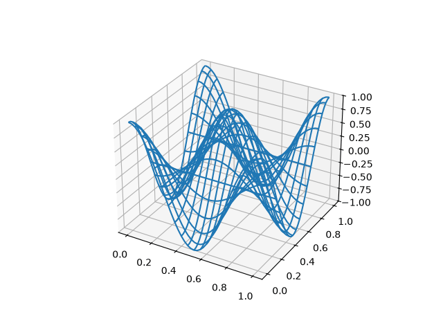

# Report

- [stationary_waves_report.ipynb](stationary_waves_report.ipynb) — answers to the *Exact solution*, *Dispersion coefficient* and *Test for exact solution* questions.
- `neumannwave.gif` — the Neumann problem with $m_x = m_y = 2$ and $C = 1/\sqrt{2}$, one full period:

